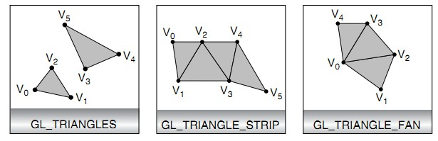

[转载LearnOpenGL](https://learnopengl-cn.github.io)

图形渲染管线的每个阶段
-------------------

标准化设备坐标
------------

常用绘制三角形的方式
------------------

OpenGL值绘制三角形的方式常用的有三种，分别是GL_TRIANGLES、GL_TRIANGLE_STRIP、GL_TRIANGLE_FAN，其效果如依次是：

1).GL_TRIANGLES：每三个顶点绘制一个三角形，如果顶点数量不是3的倍数，则忽略最后一个或两个顶点。

2).GL_TRIANGLE_STRIP：有两种情况，

①当前顶点序号n是偶数时，三角形三个顶点的顺序是(n - 2, n - 1, n )。

②当前顶点序号n是奇数时，三角形三个顶点的顺序是(n - 1, n - 2, n)。

这两种情况，保证了采用此种渲染方式的三角形顶点的卷绕顺序。（一般规定逆时针卷绕为正方向）

例如：对于v2顶点，其序号为2，此时三个顶点的顺序是(v0, v1, v2)；对于v3顶点，其序号为3，此时三个顶点的顺序是(v2, v1, v3)，均是逆时针卷绕。

3).GL_TRIANGLE_FAN：一系列顶点中的第一个点为中心点，其他顶点为边缘点，绘制一系列组成扇形的相邻三角形。例如三角形(v0, v1, v2)、(v0, v2, v3)。