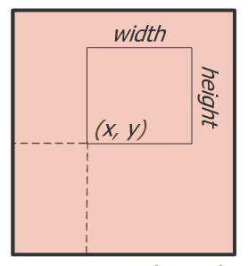
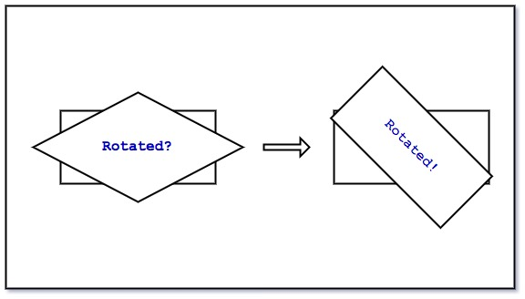
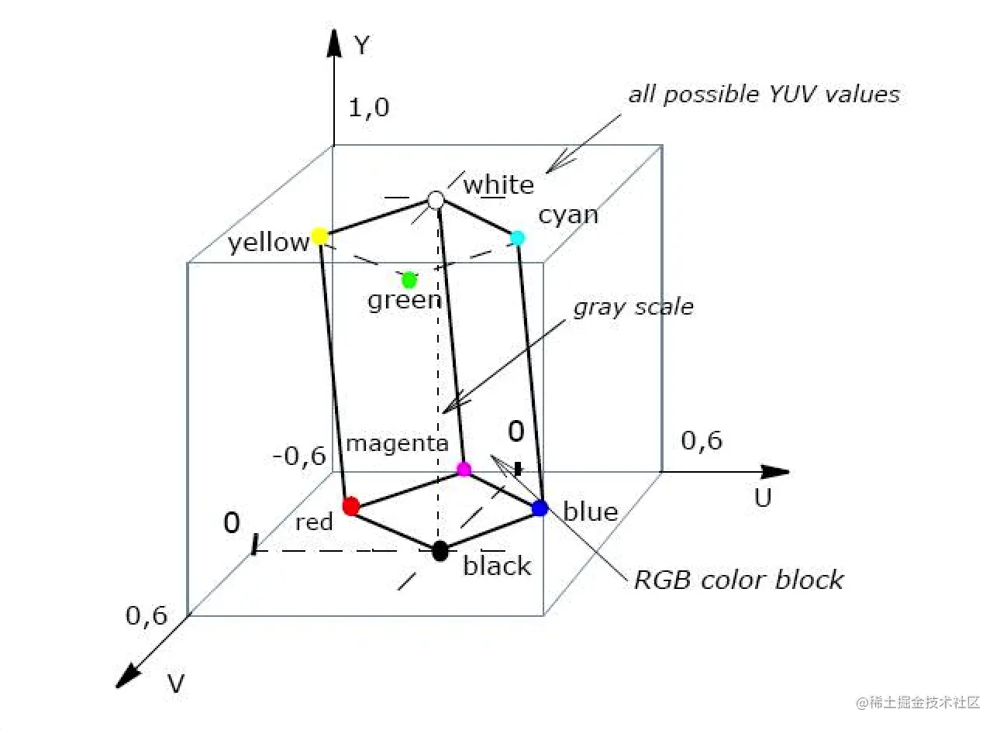

[转载LearnOpenGL](https://learnopengl-cn.github.io)

视口
---

```oclight
glViewport(0, 0, 800, 600);
```

OpenGL幕后使用glViewport中定义的位置和宽高进行2D坐标的转换，将OpenGL中的位置坐标转换为你的屏幕坐标。
例如，OpenGL中的坐标(-0.5, 0.5)有可能（最终）被映射为屏幕中的坐标(200,450)。
注意，处理过的OpenGL坐标范围只为-1到1，因此我们事实上将(-1到1)范围内的坐标映射到(0, 800)和(0, 600)。

```oclight
glViewport(int x, int y, int width, int height)
```



[旋转](http://neevek.net/posts/2017/11/26/opengl-rotating-mapped-texture-in-a-rectangular-viewport.html)
---



```oclight
float aspect_ratio = viewport_height / viewport_width;
glm::mat4 transform;
transform = glm::rotate(transform, glm::radians(45), glm::vec3(0.0f, 0.0f, 1.0f));
transform = glm::scale(transform, glm::vec3(1.0f, aspect_ratio, 1.0f));
glm::mat4 ortho_proj = glm::ortho(
    -1.0f,              // left
    1.0f,               // right
    -aspect_ratio,      // bottom
    aspect_ratio,       // top
    0.1f,               // near plane
    0.0f                // far plane
    ) * transform;    
```

[YUV和RGB对应关系](https://juejin.cn/post/7208015274079256635)
---
