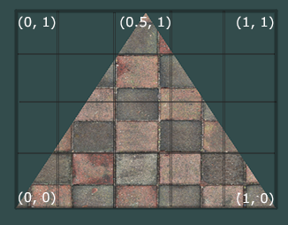

[转载LearnOpenGL](https://learnopengl-cn.github.io)

纹理环绕方式
-----------


```oclight
glTexParameteri(GL_TEXTURE_2D, GL_TEXTURE_WRAP_S, GL_MIRRORED_REPEAT);
glTexParameteri(GL_TEXTURE_2D, GL_TEXTURE_WRAP_T, GL_MIRRORED_REPEAT);
```

如果我们选择GL_CLAMP_TO_BORDER选项，我们还需要指定一个边缘的颜色。
```oclight
float borderColor[] = { 1.0f, 1.0f, 0.0f, 1.0f };
glTexParameterfv(GL_TEXTURE_2D, GL_TEXTURE_BORDER_COLOR, borderColor);
```


纹理过滤
-------


```oclight
glTexParameteri(GL_TEXTURE_2D, GL_TEXTURE_MIN_FILTER, GL_NEAREST);
glTexParameteri(GL_TEXTURE_2D, GL_TEXTURE_MAG_FILTER, GL_LINEAR);
```

多级渐远纹理
-----------


```oclight
glTexParameteri(GL_TEXTURE_2D, GL_TEXTURE_MIN_FILTER, GL_LINEAR_MIPMAP_LINEAR);
glTexParameteri(GL_TEXTURE_2D, GL_TEXTURE_MAG_FILTER, GL_LINEAR);
```


2D纹理坐标范围
-------------




坐标系统变换
-----------

局部空间(Local Space，或者称为物体空间(Object Space))  
世界空间(World Space)  
观察空间(View Space，或者称为视觉空间(Eye Space))  
裁剪空间(Clip Space)  
屏幕空间(Screen Space)  

```
gl_Position = projection * view * model * vec4(aPos, 1.0); //记住我们需要从右往左阅读矩阵的乘法
```


向量相乘
-------

#### 点乘  

两个向量的点乘等于它们的数乘结果乘以两个向量之间夹角的余弦值。可能听起来有点费解，我们来看一下公式：  
v¯⋅k¯=||v¯||⋅||k¯||⋅cosθ

它们之间的夹角记作θ。为什么这很有用？想象如果v¯和k¯都是单位向量，它们的长度会等于1。这样公式会有效简化成：  
v¯⋅k¯=1⋅1⋅cosθ=cosθ

现在点积只定义了两个向量的夹角。你也许记得90度的余弦值是0，0度的余弦值是1。使用点乘可以很容易测试两个向量是否正交(Orthogonal)或平行（正交意味着两个向量互为直角）。

#### 叉乘(右手定则)


#### 矩阵乘法

1.只有当左侧矩阵的列数与右侧矩阵的行数相等，两个矩阵才能相乘。  
2.矩阵乘法不满足交换律(Commutative)，也就是说A⋅B≠B⋅A。  


朝向
----

