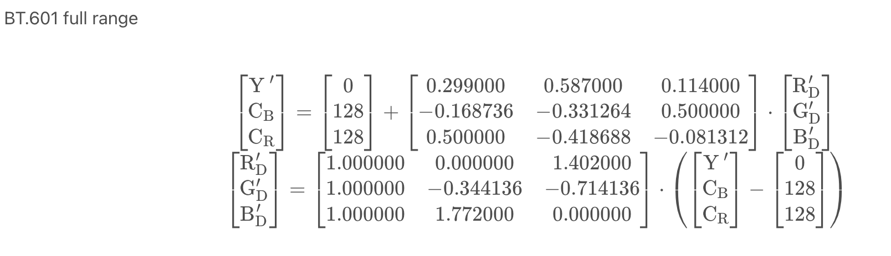
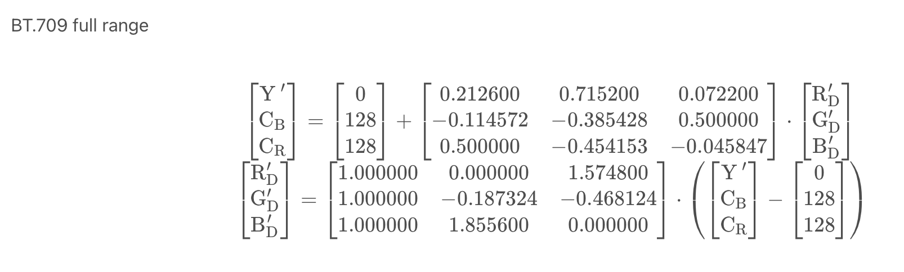
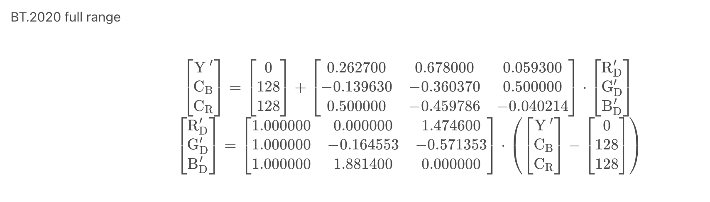
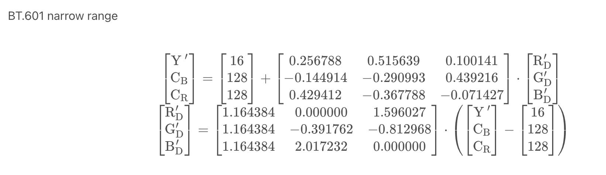
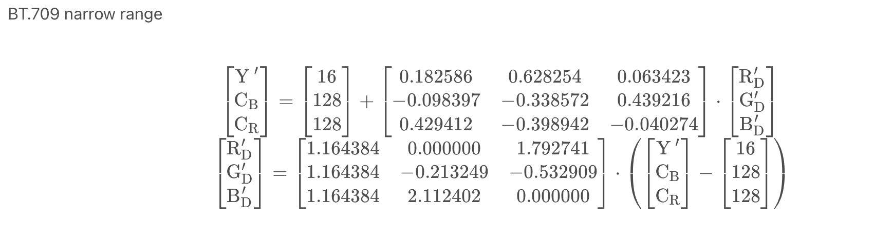
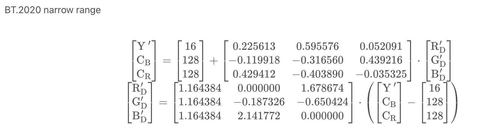
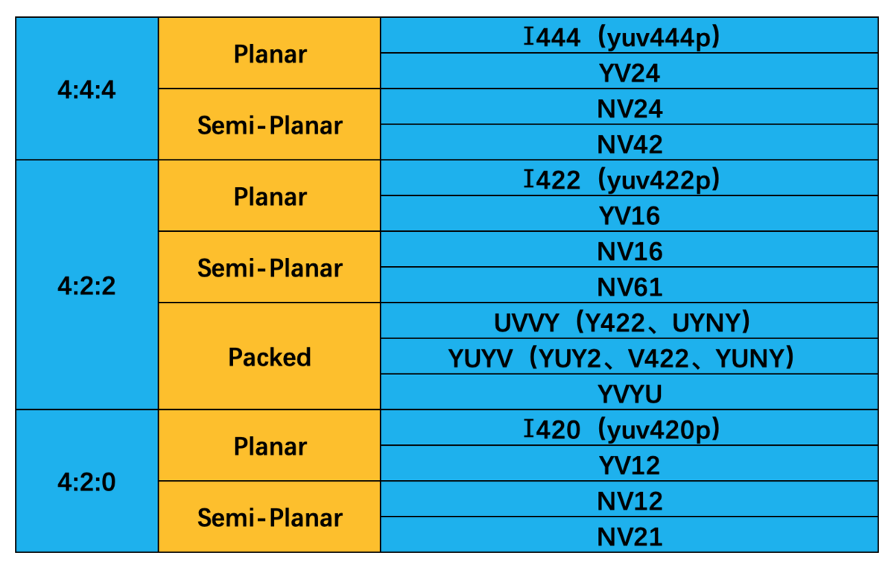
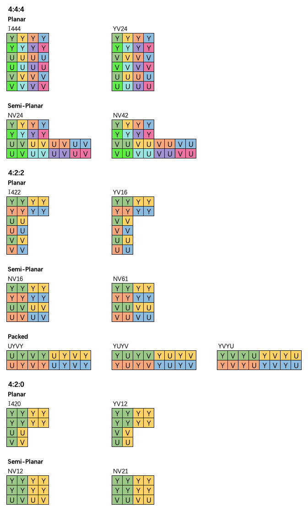

# YUV类型

电视机一般只支持240个色阶，从16~240，这就是limited；  
电脑显示器支持255个色阶，从0～255，这就是full。

BT.601用于SDTV(标清)，BT.709用于HDTV(高清)，BT.2020用于UHDTV(超清)。

1. full range

   `Y / U / V 的范围是[0, 255]`

   

   

   

2. limited range

   `Y 的范围是[16,235]，UV 的范围是[16,240]`

   

   

   

3. 存储格式分类

   YUV 的存储格式可以分为 3 大类：  
   Planar（平面）： Y、U、V 分量分开单独存储； 名称通常以字母 p 结尾。  
   Semi-Planar（半平面）： Y 分量单独存储，U、V 分量交错存储 。  
   Packed（紧凑）： 或者叫 Interleaved（交错）； Y、U、V 分量交错存储。

   

4. 采样格式排列方式

   

[参考网站1](https://www.pudn.com/news/627ce84e9b6e2b6d551bec5f.html)

[参考网站2](https://www.jianshu.com/p/58ea9aff3bae?utm_campaign=maleskine&amp%3Butm_content=note&amp%3Butm_medium=seo_notes&amp%3Butm_source=recommendation)