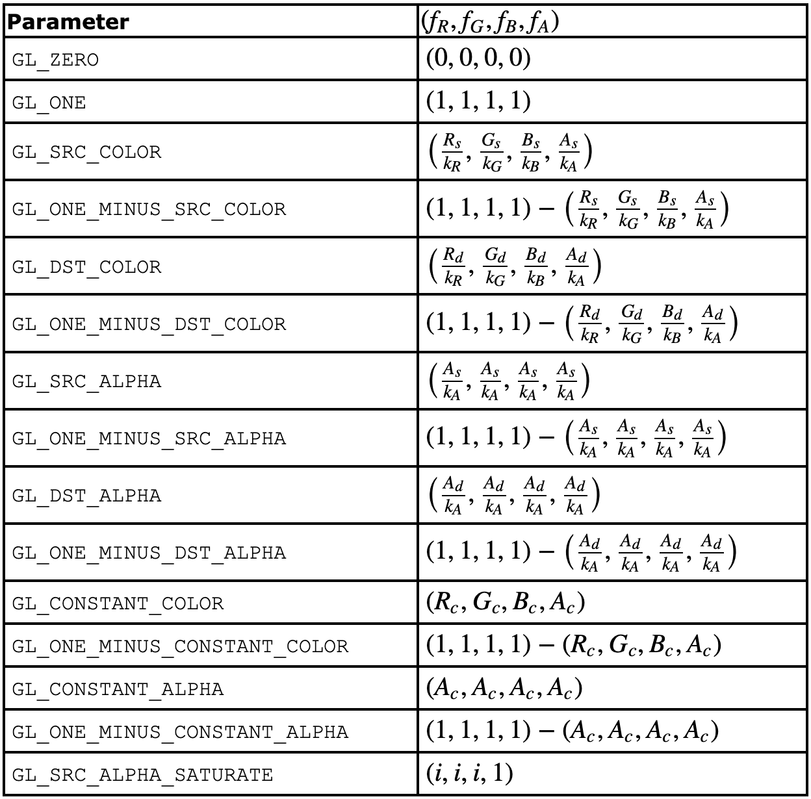
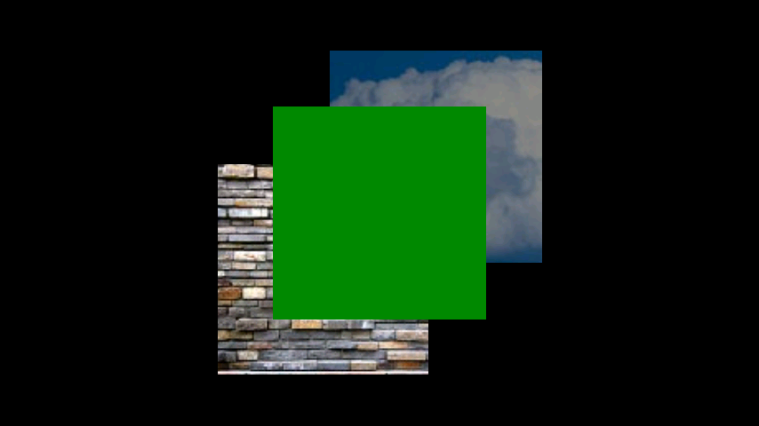
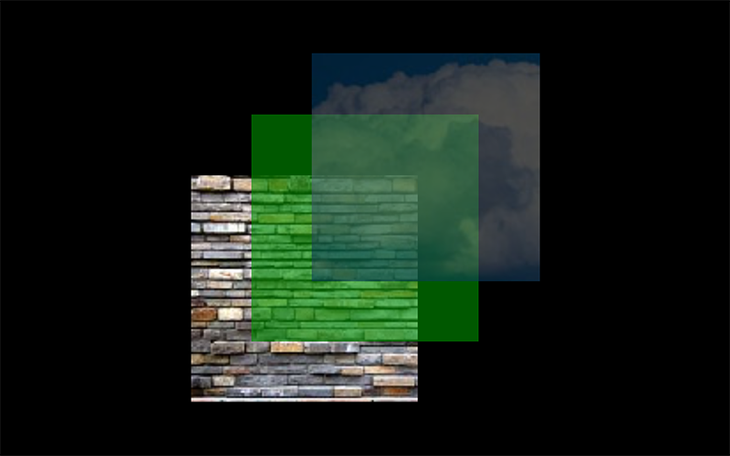

### 混合模式

```kotlin
glEnable(GL_BLEND)
// 混合模式实现alpha * color，所以texture输出的颜色不能做预乘
glBlendFunc(GL_SRC_ALPHA, GL_ONE_MINUS_SRC_ALPHA)
```



最终输出颜色：

```kotlin
// (Rs, Gs, Bs, As)代表源颜色src(要绘制的颜色)；  
// (Rd, Gd, Bd, Ad)代表目标颜色Dest(缓冲区中颜色)；
// (kR, kG, kB, kA)代表缓冲区中各个通道R, G, B, A的最大值；
// (sR, sG, sB, sA)代表源颜色src经过上表转换后的值；
// (dR, dG, dB, dA)代表目标颜色Dest经过上表转换后的值。
R = min(kR, Rs * sR + Rd * dR)
G = min(kG, Gs * sG + Gd * dG)
B = min(kB, Bs * sB + Bd * dB)
A = min(kA, As * sA + Ad * dA)
```

函数实质作用：  
控制`新画上来的颜色 (source values, RGBA)`和已经在`帧缓冲区中的颜色 (destination values, RGBA)`的混合时，
`源与目标 在最终颜色通道中所占的比例`。

举个例子：

1. `glBlendFunc(GL_ONE, GL_ZERO)`这种参数因子组合混合比例是`(1.0, 0.0)`。  
   即 源颜色（最后绘制的绿色矩形）覆盖目标色（缓冲区中颜色）；目标色（缓冲区中颜色）不起作用。  
     
   三个矩形（Z轴深度由深到浅）分别为，石头墙、绿色矩形、蓝色云彩。

2. `glBlendFunc(GL_SRC_ALPHA, GL_ONE_MINUS_SRC_ALPHA)`这种参数因子组合混合比例`(As/kA, 1.0-As/kA)`。  
   即 源颜色（最后绘制的绿色矩形）与 目标色（缓冲区中颜色）在混合时，取源颜色的`src*(As/kA)`与目标颜色`dest*(1.0-As/kA)`
   相加计算最终的颜色值。  
   

3. 假设，源RGBA(1, 1, 0, 0.6)，目标RGBA(0.6, 0.6, 0.5, 1)，使用`glBlendFunc(GL_ONE, GL_ONE_MINUS_SRC_ALPHA)`
   混合模式。  
   result.r = min(1, 1 * 1 + 0.6 * (1 - 0.6)) = 1  
   result.g = min(1, 1 * 1 + 0.6 * (1 - 0.6)) = 1  
   result.b = min(1, 0 * 1 + 0.5 * (1 - 0.6)) = 0.2  
   result.a = min(1, 0.6 * 1 + 1 * (1 - 0.6)) = 1

### 转载自以下文章

[一文详解 OpenGL ES 纹理颜色混合](https://www.cnblogs.com/xiaxveliang/p/15694599.html)

[OpenGL的混合模式，解决半透明像素渲染问题](https://www.jianshu.com/p/b4f585a9bd5e)

[OpenGL glBlendFunc文档](https://registry.khronos.org/OpenGL-Refpages/es3/html/glBlendFunc.xhtml)