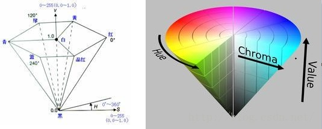

[转载](https://www.cnblogs.com/tinywan/p/6404411.html)
-----------------------------------------------------

5H.264有四种画质级别,分别是baseline, extended, main, high：
------------------------------------------------------

1、Baseline Profile：基本画质。支持I/P 帧，只支持无交错（Progressive）和CAVLC；  
2、Extended profile：进阶画质。支持I/P/B/SP/SI 帧，只支持无交错（Progressive）和CAVLC；(用的少)  
3、Main profile：主流画质。提供I/P/B 帧，支持无交错（Progressive）和交错（Interlaced）， 也支持CAVLC 和CABAC 的支持；  
4、High profile：高级画质。在main Profile 的基础上增加了8x8内部预测、自定义量化、 无损视频编码和更多的YUV 格式；  

H.264 Baseline profile、Extended profile和Main profile都是针对8位样本数据、4:2:0格式(YUV)的视频序列。
在相同配置情况下，High profile（HP）可以比Main profile（MP）降低10%的码率。 根据应用领域的不同，
Baseline profile多应用于实时通信领域，Main profile多应用于流媒体领域，High profile则多应用于广电和存储领域。


profile 主要参数：
----------------


Level 主要参数：
--------------


[H.264 structure](https://zhuanlan.zhihu.com/p/71928833)
--------------------------------------------------------


H.264的主要目标是：高压缩比 和 良好的网络亲和性。  
为此，H.264的功能分为两层，即视频编码层（VCL）和网络提取层（NAL)。  
VCL数据即编码处理的输出，它表示被压缩编码后的视频数据序列。在VCL数据传输或存储之前，这些编码的VCL数据，先被映射或封装进NAL单元中。  
“NAL”就是为了包装“VCL”以达到更好网络传输效果。  
NAL会打包VCL数据，但是这并不意味着所有的NALU负载的都是VCL，也有一些NALU仅仅存储了和编解码信息相关的数据。


VCL（Video Coding Layer），视频编码层，H264编码/压缩的核心，主要负责将视频数据编码/压缩，再切分。  
NAL（Network Abstraction Layer），网络抽象层，负责将VCL的数据组织打包。


#### VCL究竟是怎么管理H264视频数据的呢？
1.压缩：预测（帧内预测和帧间预测）-> DCT变化和量化 -> 比特流编码；  
2.切分数据，主要为了第三步。“切片(Slice)”、“宏块(Macroblock)”是在VCL中的概念，一方面提高编码效率和降低误码率、另一方面提高网络传输的灵活性。  
3.包装成“NAL”。

#### H264码流结构


#### H264的打包方式

通俗来说是H264如何组织一连串的NALU为完整的H264码流。目前H264主流的两种格式：

##### Annex-B：
```
[start code]--[NALU]--[start code]--[NALU]...
```

Start Code是Annex-B分隔NALU的办法，一般采用0x000001或0x00000001。

##### AVCC
```
[SIZE (4 bytes)]--[NAL]--[SIZE (4 bytes)]--[NAL]... //注意，SIZE一般为4字节，但是具体以实际为准
```
由NALU和extradata/sequence header组成，由于在extradata/sequence header中存储了NALU的长度，因此NALU Payload不需要做字节对齐，不过防竞争字节还是有的；

SPS和PPS被放在了extradata/sequence header。

#### NALU Header
NALU Header只占1个字节，即8位，其组成如下：
| forbidden_zero_bit | nal_ref_idc | nal_unit_type |
| ------------------ | ----------- | ------------- |
|        1 bit       |    2 bit    |    5 bit      |

forbidden_zero_bit ：禁止位，在网络传输中发生错误时，会被置为1，否则为0。  
nal_ref_idc ：指示当前NALU的优先级，或者说重要性，数值越大表明越重要。
如果它是“参照” 字段/帧(I帧)/图片，则nal_ref_idc不等于0，否则为0。根据H264标准，非零nal_ref_idcs指示NALU的内容可能为：
序列参数集（SPS），SPS扩展，子SPS，图片参数集（PPS），参照图片的切片，参照图片的切片数据分区，或参照图片的切片之前的前缀NALU。  
nal_unit_type ：表示NALU的类型。

| value  |                         description                           | NALU type |
| ------ | --------------------------------------------------------------| --------- |
| 0      | Unspecified, 未使用                                            | non-VCL |
| 1      | Coded slice of a non-IDR picture, 非IDR图像片分区               | VCL |
| 2      | Coded slice data partition A, 片分区A                          | VCL |
| 3      | Coded slice data partition B, 片分区B                          | VCL |
| 4      | Coded slice data partition C, 片分区C                          | VCL |
| 5      | Coded slice of an IDR picture, IDR图像片分区                    | VCL |
| 6      | Supplemental enhancement information (SEI)                     | non-VCL |
| 7      | Sequence parameter set (SPS)                                   | non-VCL |
| 8      | Picture parameter set (PPS)                                    | non-VCL |
| 9      | Access unit delimiter, AU分隔符                                 | non-VCL |
| 10     | End of sequence, 序列结束                                       | non-VCL |
| 11     | End of stream, 流结束                                           | non-VCL |
| 12     | Filler data, 填充数据                                           | non-VCL |
| 13     | Sequence parameter set extension                               | non-VCL |
| 14     | Prefix NAL unit                                                | non-VCL |
| 15     | Subset sequence parameter set                                  | non-VCL |
| 16     | Depth parameter set                                            | non-VCL |
| 17..18 | Reserved                                                       | non-VCL |
| 19     | Coded slice of an auxiliary coded picture without partitioning | non-VCL |
| 20     | Coded slice extension                                          | non-VCL |
| 21     | Coded slice extension for depth view components                | non-VCL |
| 22..23 | Reserved                                                       | non-VCL |
| 24..31 | Unspecified                                                    | non-VCL |

[了解更多](https://stackoverflow.com/questions/24884827/possible-locations-for-sequence-picture-parameter-sets-for-h-264-stream)

1-4：I/P/B帧，他们是依据VLC的slice区分的。  
5：IDR帧。I帧的一种，告诉解码器，之前依赖的解码参数集合（接下来要出现的SPS\PPS等）可以被刷新了。  
6：SEI(Supplemental Enhancement Information，补充增强信息)，提供了向视频码流中加入额外信息的方法。  
7：SPS(Sequence Paramater Set，序列参数集)，SPS中保存了一组编码视频序列(Coded Video Sequence)的全局参数。因此该类型保存的是和编码序列相关的参数。  
8: PPS(Picture Paramater Set，图像参数集)，该类型保存了整体图像相关的参数。  
9：AU分隔符(Access unit Delimiter)，它是一个或者多个NALU的集合，代表了一个完整的帧。H.264将构成一帧图像所有NALU的集合称为一个AU。

#### [SEI 例子](https://zhuanlan.zhihu.com/p/33720871)


##### NAL header
起始码（暗红底色）"0x00000001"分割出来的比特流即是NAL unit，起始码紧跟的第一个字节(墨绿底色)是NAL header。上图“NAL header”一共出现了四个数值：  
“0x06”，此时NRI为“00B”，NAL unit type为SEI类型。  
“0x67”，此时NRI为“11B”，NAL unit type为SPS类型。  
“0x68”，此时NRI为“11B”，NAL unit type为PPS类型。  
“0x65”，此时NRI为“11B”，NAL unit type为IDR图像。

##### SEI payload type
“0x06”后一个字节为“0x05”（淡黄底色）是SEI payload type，即表征SEI payload分析遵循user_data_unregistered()语法。

##### SEI payload size
“0x05”后一个字节为“0x2F”（淡蓝底色）是SEI payload size，此时整个payload是47个字节。

##### SEI payload uuid
“0x2F”随后的16个字节即为uuid，此时uuid为
```
dc45e9bd-e6d9-48b7-962c-d820d923eeef
```

##### SEI payload content
由于payload size是47个字节，除去16字节的uuid，剩下31个字节的content。由于content是字符串，所以有结束符"0x00"，有效的30个字符内容是：
```
Zencoder Video Encoding System
```

##### rbsp trailing bits
47个payload字节后的“0x80”（灰底色）即是rbsp trailing bits，在user_data_unregistered()里面都是按字节写入的，所以此时的NAL unit结尾写入的字节一定是0x80。

##### SEI的生成
生成SEI的方式很多，大致可以有：  
1.对已有码流做filter，插入SEI NAL；  
2.视频编码时生成SEI；  
3.容器层写入时插入SEI。

#### NALU Payload

1.SODB(String Of Data Bits，原始数据比特流)，就是最原始的编码/压缩得到的数据。

2.RBSP(Raw Byte Sequence Payload，原始字节序列载荷)，和SODB关系如下：

```
RBSP = SODB + RBSP Trailing Bits（RBSP尾部补齐字节）
```

引入RBSP Trailing Bits做8位字节补齐。


3.EBSP(Encapsulated Byte Sequence Payload，扩展字节序列载荷)，和RBSP关系如下：

```
EBSP ：RBSP插入防竞争字节（0x03）
```

EBSP相较于RBSP，多了防止竞争的一个字节：0x03。


我们知道，NALU的起始码为0x000001或0x00000001，同时H264规定，当检测到0x000000时，也可以表示当前NALU的结束。那这样就会产生一个问题，就是如果在NALU的内部，出现了0x000001或0x000000时该怎么办？

所以H264就提出了“防止竞争”这样一种机制，当编码器编码完一个NAL时，应该检测NALU内部，是否出现如下左侧的四个序列。当检测到它们存在时，编码器就在最后一个字节前，插入一个新的字节：0x03。


图中0x000000和0x000001前面介绍了，0x000002是作为保留使用，而0x000003，则是为了防止NALU内部，原本就有序列为0x000003这样的数据。

这样一来，当我们拿到EBSP时，就需要检测EBSP内是否有序列：0x000003，如果有，则去掉其中的0x03。这样一来，我们就能得到原始字节序列载荷：RBSP。

#### 解析NALU框图


[了解更多](https://www.jianshu.com/p/5f89ea2c3a28)

#### 片(Slice)

设置片的目的是为了限制误码的扩散和传输，应使编码片相互间是独立的。
某片的预测不能以其他片中的宏块为参考图像，这样某一片中的预测误差才不会传播到其他片中。

片有一下五种类型：

| 片 | 意义 |
| --- | --- |
| I 片 | 只包含I宏块 |
| P 片 | 包含P和I宏块 |
| B 片 | 包含B和I宏块 |
| SP 片 | 包含P 和/或 I宏块,用于不同码流之间的切换 |
| SI 片 | 一种特殊类型的编码宏块 |

#### 宏块(Macroblock)

宏块是视频信息的主要承载者。一个编码图像通常划分为多个宏块组成.包含着每一个像素的亮度和色度信息。

| 宏块分类 | 意义 |
| ------- | --- |
| I 宏块 | 利用从当前片中已解码的像素作为参考进行帧内预测 |
| P 宏块 | 利用前面已编码图像作为参考进行帧内预测，一个帧内编码的宏块可进一步作宏块的分割:即16×16.16×8.8×16.8×8亮度像素块。如果选了8×8的子宏块，则可再分成各种子宏块的分割，其尺寸为8×8，8×4，4×8，4×4 |
| B 宏块 | 利用双向的参考图像(当前和未来的已编码图像帧)进行帧内预测 |

#### I,P,B帧

| 帧的分类 | 中文 | 意义 |
| --- | --- | --- |
| I 帧 | 帧内编码帧,又称intra picture | I 帧通常是每个GOP（MPEG所使用的一种视频压缩技术）的第一个帧，经过适度地压缩，做为随机访问的参考点，可以当成图象。I帧可以看成是一个图像经过压缩后的产物。自身可以通过视频解压算法解压成一张单独的完整的图片。 |
| P 帧 | 前向预测编码帧,又称predictive frame | 通过充分将低于图像序列中前面已编码帧的时间冗余信息来压缩传输数据量的编码图像，也叫预测帧。需要参考其前面的一个I frame 或者B frame来生成一张完整的图片。 |
| B 帧 | 双向预测帧,又称bidirectional interpolated prediction frame | 既考虑与源图像序列前面已编码帧，也顾及源图像序列后面已编码帧之间的时间冗余信息来压缩传输数据量的编码图像,也叫双向预测帧。要参考其前一个I或者P帧及其后面的一个P帧来生成一张完整的图片。 |

#### pts/dts

| 名称 | 意义 |
| --- | --- |
| PTS(Presentation Time Stamp) | PTS主要用于度量解码后的视频帧什么时候被显示出来。 |
| DTS(Decode Time Stamp) | DTS主要是标识内存中的bit流在什么时候开始送入解码器中进行解码。 |

[了解更多](https://blog.csdn.net/andywang201001/article/details/80274886)

[H.264官方文档](https://www.itu.int/rec/T-REC-H.264)


色彩模型(Color model)
--------------------

是一种抽象数学模型，通过一组数字来描述颜色（例如RGB使用三元组、CMYK使用四元组）。

[色彩空间(Color space)](https://zh.wikipedia.org/wiki/%E8%89%B2%E5%BD%A9%E7%A9%BA%E9%96%93)
-------------------

色彩空间是对色彩的组织方式。色彩空间可以只通过任意挑选一些颜色来定义，比如像彩通系统就只是把一组特定的颜色作为样本，然后给每个颜色定义名字和代码；也可以是基于严谨的数学定义，比如 Adobe RGB、sRGB。
如果在色彩模型和一个特定的参照色彩空间之间创建特定的映射函数，那么就会在这个参照色彩空间中出现有限的“覆盖区”(footprint)，称作色域。
色彩空间由色彩模型和色域共同定义。例如Adobe RGB和sRGB都基于RGB颜色模型，但它们是两个不同绝对色彩空间(绝对色彩空间就是不依赖任何外部因素就可以准确表示颜色的色彩空间)。
定义色彩空间时，通常使用 CIELAB 或者 CIEXYZ 色彩空间作为参考标准。这两个色彩空间在设计时便要求包含普通人眼可见的所有颜色。
由于“色彩空间”有着固定的色彩模型和映射函数组合，非正式场合下，这一词汇也被用来指代色彩模型。
尽管固定的色彩空间有固定的色彩模型相对应，这样的用法严格意义上是错误的。


[了解更多](https://zhuanlan.zhihu.com/p/45533748)


HSV模型
-------



[了解更多](https://blog.csdn.net/weixin_42078760/article/details/80652062)


MediaCodec
----------

#### MediaCodec使用流程


如果客户端打算以异步模式使用组件，则应该在调用configure(MediaFormat, Surface, MediaCrypto, int)之前提供一个有效的callback。

当异步回调被启用时，客户端不应该调用dequeueInputBuffer(long)和dequeueOutputBuffer(android.media.MediaCodec.BufferInfo, long)。

异步模式setCallback(MediaCodec.Callback, Handler)可以指定回调线程。

#### 输出到surface

不渲染缓冲区：调用 releaseOutputBuffer(bufferId, false)。

使用默认的时间戳渲染缓冲区：调用 releaseOutputBuffer(bufferId, true)。

使用特定的时间戳渲染缓冲区：调用 releaseOutputBuffer(bufferId, timestamp)。

#### 同步调用流程

dequeueInputBuffer(同步模式才需要调用) -> queueInputBuffer填充数据 -> dequeueOutputBuffer(同步模式才需要调用) -> releaseOutputBuffer显示画面

#### 同步状态


#### 异步状态


#### GOP


两个关键帧中的帧个数即为GOP值。实际流编码的GOP值一般在（100-150）帧之间。

I帧：自身可以通过视频解压算法解压成一张单独的完整视频画面，所以I帧去掉的是视频帧在空间维度上的冗余信息。

P帧：需要参考前面的I帧或者P帧来解码成一张完整的视频画面。

B帧：需要参考前一个I帧或者P帧及其后面的一个P帧来生成一张完整的视频画面，所以P帧与B帧去掉的是视频帧在时间维度上的冗余信息。

[参考网站1](https://blog.csdn.net/bestwu0666/article/details/123063895)