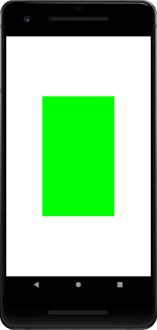

[OpenGL es 3.0 doc](https://www.khronos.org/registry/OpenGL-Refpages/es3.0/)
----------------------------------------------------------------------------

[glsl doc](http://www.shaderific.com/glsl-functions)
---------------------------------------------------

[OpenGL教程](https://learnopengl-cn.github.io/)
-------------------------------------------------


VAO + VBO画矩形
--------------

顶点着色器：  
```glsl
#version 300 es
layout(location = 0) in vec3 aPos;
out vec4 color;
void main(){
    gl_Position = vec4(aPos.xyz, 1.0);
    color = vec4(0.0, 1.0, 0.0, 1.0);
}
```

片段着色器：  
```glsl
#version 300 es
precision mediump float;
out vec4 fragColor;
in vec4 color;
void main(){
    fragColor = color;
}
```

核心代码：  
```
float[] vertices = {
            -0.5f, 0.5f, 0.0f,  // 左上角
            -0.5f, -0.5f, 0.0f, // 左下角
            0.5f, 0.5f, 0.0f,   // 右上角
            0.5f, -0.5f, 0.0f   // 右下角
};

...

//顶点数据加载到vbo
GLuint vbo;
glGenBuffers(1, &vbo);
glBindBuffer(GL_ARRAY_BUFFER, vbo);
glBufferData(GL_ARRAY_BUFFER, sizeof(vertices), vertices, GL_STATIC_DRAW);

//VAO 初始化部分
glGenVertexArrays(1, &vao);
glBindVertexArray(vao);

//开始保存状态
glBindBuffer(GL_ARRAY_BUFFER, vbo);
glVertexAttribPointer(0, 3, GL_FLOAT, GL_FALSE, 3 * sizeof(float), (void *) 0);
glEnableVertexAttribArray(0);

//保存结束
glBindVertexArray(0);

...

glClearColor(1.0f, 1.0f, 1.0f, 1.0f);
glClear(GL_COLOR_BUFFER_BIT);

glUseProgram(program);
glBindVertexArray(vao);
glDrawArrays(GL_TRIANGLE_STRIP, 0, 4);
glBindVertexArray(0);
```




VAO + EBO + VBO画矩形
--------------------

顶点着色器：  
```glsl
#version 300 es
layout(location = 0) in vec3 aPos;
out vec4 color;
void main(){
    gl_Position = vec4(aPos.xyz, 1.0);
    color = vec4(0.0, 1.0, 0.0, 1.0);
}
```

片段着色器：  
```glsl
#version 300 es
precision mediump float;
out vec4 fragColor;
in vec4 color;
void main(){
    fragColor = color;
}
```

核心代码：  
```
float[] vertices = {
            0.5f, 0.5f, 0.0f,   // 右上角
            0.5f, -0.5f, 0.0f,  // 右下角
            -0.5f, -0.5f, 0.0f, // 左下角
            -0.5f, 0.5f, 0.0f   // 左上角
};

int indices[] = { // 注意索引从0开始!
            0, 1, 3, // 第一个三角形
            1, 2, 3  // 第二个三角形
};

...

//顶点数据加载到vbo
GLuint vbo;
glGenBuffers(1, &vbo);
glBindBuffer(GL_ARRAY_BUFFER, vbo);
glBufferData(GL_ARRAY_BUFFER, sizeof(vertices), vertices, GL_STATIC_DRAW);

//索引数据加载到ebo
GLuint ebo;
glGenBuffers(1, &ebo);
glBindBuffer(GL_ELEMENT_ARRAY_BUFFER, ebo);
glBufferData(GL_ELEMENT_ARRAY_BUFFER, sizeof(indices), indices, GL_STATIC_DRAW);

//VAO 初始化部分
glGenVertexArrays(1, &vao);
glBindVertexArray(vao);

//开始保存状态
glBindBuffer(GL_ARRAY_BUFFER, vbo);
glVertexAttribPointer(0, 3, GL_FLOAT, GL_FALSE, 3 * sizeof(float), (void *) 0);
glEnableVertexAttribArray(0);

glBindBuffer(GL_ELEMENT_ARRAY_BUFFER, ebo);

//保存结束
glBindVertexArray(0);

...

glClearColor(1.0f, 1.0f, 1.0f, 1.0f);
glClear(GL_COLOR_BUFFER_BIT);

glUseProgram(program);
glBindVertexArray(vao);
//glDrawElements(GL_LINE_LOOP, 6, GL_UNSIGNED_INT, 0);//画线
glDrawElements(GL_TRIANGLES, 6, GL_UNSIGNED_INT, 0);
glBindVertexArray(0);
```


OpenGL常用方法代码
----------------

```
/**
 * Compiles the provided shader source.
 *
 * @return A handle to the shader, or 0 on failure.
 */
public static int loadShader(int shaderType, String source) {
    int shader = GLES30.glCreateShader(shaderType);
    checkGlError("glCreateShader type=" + shaderType, false);
    // 加载shader的源代码
    GLES30.glShaderSource(shader, source);
    // 编译shader
    GLES30.glCompileShader(shader);
    int[] compiled = new int[1];
    GLES30.glGetShaderiv(shader, GLES30.GL_COMPILE_STATUS, compiled, 0);
    if (compiled[0] == 0) {
        Log.e(TAG, "Could not compile shader " + shaderType + ":");
        Log.e(TAG, " " + GLES30.glGetShaderInfoLog(shader));
        GLES30.glDeleteShader(shader);
        shader = 0;
    }
    // shader句柄
    return shader;
}
```

```
/**
 * Checks to see if a GLES error has been raised.
 */
public static void checkGlError(String op) {
    int error = GLES30.glGetError();
    if (error != GLES30.GL_NO_ERROR) {
        String msg = op + ": glError 0x" + Integer.toHexString(error);
        Log.e(TAG, msg);
    }
}
```

```
/**
 * Creates a new program from the supplied vertex and fragment shaders.
 *
 * @return A handle to the program, or 0 on failure.
 */
public static int createProgram(String vertexSource, String fragmentSource) {
    // 加载顶点着色器
    int vertexShader = loadShader(GLES30.GL_VERTEX_SHADER, vertexSource);
    if (vertexShader == 0) {
        return 0;
    }
    // 加载片段着色器
    int pixelShader = loadShader(GLES30.GL_FRAGMENT_SHADER, fragmentSource);
    if (pixelShader == 0) {
        GLES30.glDeleteShader(vertexShader);
        return 0;
    }

    // 创建程序
    int program = GLES30.glCreateProgram();
    checkGlError("glCreateProgram");
    if (program == 0) {
        Log.e(TAG, "Could not create program");
    }
    // 向程序中加入顶点着色器
    GLES30.glAttachShader(program, vertexShader);
    checkGlError("glAttachShader");
    // 向程序中加入片段着色器
    GLES30.glAttachShader(program, pixelShader);
    checkGlError("glAttachShader");
    // 链接程序
    GLES30.glLinkProgram(program);
    int[] linkStatus = new int[1];
    GLES30.glGetProgramiv(program, GLES30.GL_LINK_STATUS, linkStatus, 0);
    if (linkStatus[0] != GLES30.GL_TRUE) {
        Log.e(TAG, "Could not link program: ");
        Log.e(TAG, GLES30.glGetProgramInfoLog(program));
        GLES30.glDeleteProgram(program);
        program = 0;
    }
    GLES30.glDeleteShader(vertexShader);
    GLES30.glDeleteShader(pixelShader);
    return program;
}
```

```
/**
 * 加载bitmap纹理
 * @return 纹理句柄
 */
public static int createTexture(Bitmap bitmap) {
    int[] textureId = new int[1];
    GLES30.glGenTextures(1, textureId, 0);

    GLES30.glBindTexture(GLES30.GL_TEXTURE_2D, textureId[0]);

    GLES30.glTexParameterf(GLES30.GL_TEXTURE_2D,
            GLES30.GL_TEXTURE_MAG_FILTER, GLES30.GL_LINEAR);
    GLES30.glTexParameterf(GLES30.GL_TEXTURE_2D,
            GLES30.GL_TEXTURE_MIN_FILTER, GLES30.GL_LINEAR);
    GLES30.glTexParameterf(GLES30.GL_TEXTURE_2D,
            GLES30.GL_TEXTURE_WRAP_S, GLES30.GL_CLAMP_TO_EDGE);
    GLES30.glTexParameterf(GLES30.GL_TEXTURE_2D,
            GLES30.GL_TEXTURE_WRAP_T, GLES30.GL_CLAMP_TO_EDGE);
    android.opengl.GLUtils.texImage2D(GLES30.GL_TEXTURE_2D, 0, bitmap, 0);
    GlUtil.checkGlError("glTexImage2D");
    return textureId[0];
}
```

```
/**
 * Allocates a direct float buffer, and populates it with the float array data.</br>
 * 主要用于java，把float数组转为底层内存连续的数据，opengl需要的顶点数据要求内存连续
 */
public static FloatBuffer createFloatBuffer(float[] coords) {
    // Allocate a direct ByteBuffer, using 4 bytes per float, and copy coords into it.
    ByteBuffer bb = ByteBuffer.allocateDirect(coords.length * SIZEOF_FLOAT);
    bb.order(ByteOrder.nativeOrder());
    FloatBuffer fb = bb.asFloatBuffer();
    fb.put(coords);
    fb.position(0);
    return fb;
}
```